# Kế Hoạch: Fix Loss Plateau ở 12 & Cải Thiện Chất Lượng Âm Thanh (PersonaPlex-Q)

Tài liệu tham khảo: [Adapting Moshi for Low-Resource Speech Translation](https://cohere-labs-community.github.io/blog/2026/adapting-moshi-low-resource-speech-translation/)

---

## 1. Vấn Đề Hiện Tại

- **Loss plateau ở ~12**: Không giảm tiếp bất kể số bước train. Về mặt lý thuyết với vocabulary kích thước 2048, random baseline cross-entropy là `ln(2048) ≈ 7.6`. Mức loss ~12 cho thấy mô hình đang bị lệch target / misalignment thay vì chỉ đơn thuần là underfitting.
- **Âm thanh khó ra tiếng chuẩn**: Giọng bị nghẹt, mất chi tiết âm học (acoustic detail) hoặc lộn xộn.
- **Thiếu metrics đánh giá speech quality**: Hệ thống hiện chỉ tính loss token và một số chỉ số đàm thoại/turn-taking, thiếu các thước đo chất lượng âm thanh khách quan (STOI, PESQ, DNSMOS, MCD).

---

## 2. Root Cause Analysis (RCA)

### 🔴 RCA-1: Bug Double Delay (Nghiêm Trọng Nhất)
- **Vị trí**: [`sequence.py`](file:///Users/hypnotic_05/Personaplex-Q/src/personaplex_finetuning/sequence.py) kết hợp [`qwen_lm.py`](file:///Users/hypnotic_05/Personaplex-Q/src/personaplex_finetuning/qwen_lm.py)
- **Cơ chế**:
  1. Trong `train.py`, `build_example()` gọi `builder.apply_delays(...)`, làm dịch các stream codebook (CB1–7) đi 1 frame (Lần 1).
  2. Khi đưa vào `QwenMoshiLM.forward_train(codes)`, hàm này lại tiếp tục gọi `_delay_sequence(self.delays, codes, initial)` (Lần 2).
  3. Kết quả là CB1–7 bị shift tận 2 frames thay vì 1 frame. Model nhận input tại thời điểm `t` nhưng phải đoán target ở `t+2` → misalignment nghiêm trọng khiến loss không thể hội tụ.

### 🔴 RCA-2: Target Lệch Khung Thời Gian Trong Loss
- **Vị trí**: [`train.py#loss_components`](file:///Users/hypnotic_05/Personaplex-Q/src/personaplex_finetuning/train.py)
- **Cơ chế**:
  - `model_output.logits` đã được gọi `_undelay_sequence` để đưa về timeline gốc (unshifted).
  - Tuy nhiên `codes` được truyền vào làm target lại là mảng `example.input_codes` (đã bị delay từ trước).
  - Do đó logits và target lệch khung thời gian nhau.

### 🟡 RCA-3: Bỏ Sót Codebooks 8–15 Đối Với Qwen Backbone
- **Vị trí**: [`train.py#L211-L215`](file:///Users/hypnotic_05/Personaplex-Q/src/personaplex_finetuning/train.py#L211-L215)
- **Cơ chế**:
  - Khi dùng Qwen backbone với `dep_q = 16`, logits có 16 codebooks (`[B, 16, T, card]`).
  - Code loss đang hardcode: `model_output.logits[:, 1:8]` (chỉ tính CB1 đến CB7), bỏ qua hoàn toàn các codebooks từ 8 đến 15.
  - Các codebook này không nhận gradient và không được tối ưu.

### 🟡 RCA-4: Trọng Số `nonsemantic_audio_weight` Quá Nhỏ
- **Vị trí**: [`objective.py`](file:///Users/hypnotic_05/Personaplex-Q/src/personaplex_finetuning/objective.py)
- **Cơ chế**:
  - Giá trị mặc định `nonsemantic_audio_weight = 0.02` khiến gradient cho các codebook âm học (CB1–7) gần như bị triệt tiêu. Model chỉ tối ưu CB0 (semantic) mà bỏ qua acoustic details, dẫn đến âm thanh đầu ra bị mờ/muffled.
  - Khuyến nghị nâng lên khoảng `0.1` như trong các nghiên cứu thực nghiệm tương tự.

### 🟡 RCA-5: `text_padding_weight` Gây Thổi Phồng Loss
- **Vị trí**: [`objective.py`](file:///Users/hypnotic_05/Personaplex-Q/src/personaplex_finetuning/objective.py)
- **Cơ chế**:
  - Khoảng 80–90% text stream trong hội thoại là padding token. Trọng số `text_padding_weight = 0.3` khiến loss của phần padding chiếm tỉ trọng quá lớn trong tổng loss.
  - Khuyến nghị điều chỉnh về `0.1`.

---

## 3. Kế Hoạch Thay Đổi (Proposed Changes)

```mermaid
flowchart TD
    subgraph Bug_Double_Delay["Double Delay Issue"]
        A["Sequence Builder (build_example)"] -->|"Apply delay lần 1"| B["Codes đã shift"]
        B -->|"Vào QwenMoshiLM.forward_train"| C["_delay_sequence (Lần 2) ❌"]
        C --> D["Target lệch timeline, Loss plateau ~12"]
    end
    subgraph Fix_Solution["Giải Pháp Đề Xuất"]
        E["build_example"] -->|"Giữ codes gốc (không pre-delay)"| F["Codes gốc"]
        F -->|"QwenMoshiLM tự delay 1 lần duy nhất"| G["forward_train"]
        G --> H["Undelay khớp đúng target gốc ✅"]
    end
```



### Component 1: Sửa Triệt Để Double Delay & Target Alignment
1. **[`src/personaplex_finetuning/train.py`](file:///Users/hypnotic_05/Personaplex-Q/src/personaplex_finetuning/train.py)**:
   - Trong `build_example`: Không gọi `apply_delays` đối với Qwen backbone (để `QwenMoshiLM.forward_train` tự xử lý `_delay_sequence` 1 lần duy nhất).
   - Trong `loss_components`:
     - Sử dụng dynamic `dep_q = model_output.logits.shape[1]` thay vì hardcode slice `1:8`.
     - Đảm bảo `audio_target` và `text_target` khớp đúng shape và timeline với logits.

### Component 2: Cân Bằng Trọng Số Loss Objective
2. **[`src/personaplex_finetuning/objective.py`](file:///Users/hypnotic_05/Personaplex-Q/src/personaplex_finetuning/objective.py)**:
   - Cập nhật mặc định:
     - `nonsemantic_audio_weight`: từ `0.02` → `0.1` (giúp học tốt các tầng âm học CB1+).
     - `text_padding_weight`: từ `0.3` → `0.1` (giảm nhiễu do padding text chiếm đa số frames).

### Component 3: Bổ Sung Logging Chi Tiết Từng Codebook
3. **[`src/personaplex_finetuning/train.py`](file:///Users/hypnotic_05/Personaplex-Q/src/personaplex_finetuning/train.py)**:
   - Ghi nhận loss riêng biệt cho từng codebook (CB0, CB1, ..., CB_k) vào TensorBoard và metrics JSONL để theo dõi trực quan xem tầng nào chưa học được.


5. **[`src/personaplex_benchmark/metrics/__init__.py`](file:///Users/hypnotic_05/Personaplex-Q/src/personaplex_benchmark/metrics/__init__.py)**:
   - Export các hàm tính chất lượng âm thanh để benchmark và training loop cùng sử dụng.
6. **[`src/personaplex_finetuning/train.py`](file:///Users/hypnotic_05/Personaplex-Q/src/personaplex_finetuning/train.py)**:
   - Tích hợp tính tự động STOI / PESQ / MCD trong hàm định kỳ `infer_every_steps`.

### Component 5: Công Cụ Kiểm Tra Alignment (Diagnostic Tool)
7. **[`src/tools/debug_delays.py`](file:///Users/hypnotic_05/Personaplex-Q/src/tools/debug_delays.py)** (Mới):
   - Script độc lập kiểm tra xem codes đưa vào model có bị shift lặp hay lệch token ban đầu không trước khi chạy job huấn luyện dài hạn.

---

## 4. Kế Hoạch Kiểm Thử & Xác Minh (Verification Plan)

### Automated Tests
```bash
# 1. Chạy unit tests hiện có trong dự án
python -m pytest tests/test_objective.py tests/test_sequence.py tests/test_train.py -v

# 2. Chạy chẩn đoán alignment delay
python src/tools/debug_delays.py configs/config.yaml

# 3. Test smoke 1 bước kiểm tra luồng forward & backward
python -m personaplex_finetuning.train --config configs/config.yaml --smoke

# 4. Kiểm tra bộ metric âm thanh
python -m pytest tests/test_benchmark_metrics.py -v
```

### Manual Verification
- **Xu hướng Loss**: Khi hết bug double-delay và target lệch, loss có thể bắt đầu lại ở mức ~16 (tương ứng baseline ngẫu nhiên có trọng số mới) và giảm dần đều qua các bước thay vì đứng khựng ở 12.
- **Audio Output**: Nghe file âm thanh sinh ra tại thư mục `runs/.../infer/` sau mỗi kỳ `infer_every_steps` để kiểm tra độ rõ và tự nhiên.
